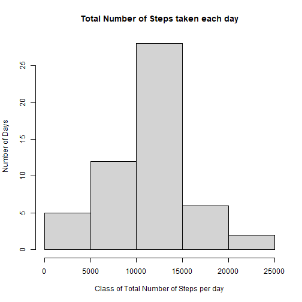

```r
knitr::opts_chunk$set(echo = TRUE)
knitr::opts_knit$set(root.dir = getwd())
```


```r
getwd()
```

```
## [1] "D:/TEST_DSToolBox/RepData_PeerAssessment1"
```
## Reading data 


```r
library(reshape2)
df <- read.csv("./activity.csv",header=TRUE)
```
## Calculate SUM of Steps Taken by day 

```r
df1<-tapply(df$steps,factor(df$date), sum)
df1 <- as.data.frame(df1)
df1$date=rownames(df1)
names(df1) <- c("value","date")
dfMelt<- melt(df1,id=c("date"),measure.vars=c("value"))
```
## Calculate HISTO/Frequency of steps per day

```r
hist(dfMelt$value, xlab="Class of Total Number of Steps per day", ylab="Number of Days", main="Total Number of Steps taken each day")
```



## Calculate mean steps

```r
mean<- mean(dfMelt$value,na.rm = TRUE)
print(mean)
```

```
## [1] 10766.19
```

## Calculate median steps

```r
median<- median(dfMelt$value,na.rm = TRUE)
print(median)
```

```
## [1] 10765
```
## Calculate pattern of average steps in day

```r
meanStepsbyInterval<-aggregate(df$steps,by=list(df$interval), FUN=mean,na.rm=TRUE)
names(meanStepsbyInterval) <- c("interval","meanSteps")
with(meanStepsbyInterval, plot(interval, meanSteps, type = "l"))
```


## Calculate interval with max steps

```r
maxInterval <-  meanStepsbyInterval[meanStepsbyInterval$meanSteps==max(meanStepsbyInterval$meanSteps),"interval"]
print(maxInterval)
```

```
## [1] 835
```

## Calculate number of NAs

```r
na <- df[is.na(df$steps),"steps"]
print(length(na))
```

```
## [1] 2304
```

## Define df1 with NAs replaced by mean for that interval

```
## 'data.frame':	17568 obs. of  3 variables:
##  $ steps   : num  1.717 0.3396 0.1321 0.1509 0.0755 ...
##  $ date    : chr  "2012-10-01" "2012-10-01" "2012-10-01" "2012-10-01" ...
##  $ interval: int  0 5 10 15 20 25 30 35 40 45 ...
```

## Histo of steps taken without NAs

```r
sumStepsbyDate <- aggregate(df1$steps,by=list(df1$date),sum)
names(sumStepsbyDate) =c("date","sumSteps")
hist(sumStepsbyDate$sumSteps, xlab="Class of Total Number of Steps per day", ylab="Number of Days", main="Total Number of Steps taken each day w/o NAs")
```


## Calculate mean steps w/o NAs

```r
mean<- mean(sumStepsbyDate$sumSteps)
print(mean)
```

```
## [1] 10766.19
```

## Calculate median steps w/o NAs

```r
median<- median(sumStepsbyDate$sumSteps)
print(median)
```

```
## [1] 10766.19
```


## Pattern of Steps in WorkDay and Holiday

```r
dayOfWeek <- function(df1) 
{
  index <- 1
  # df1 <- df
  
  while(index <= length(df1[,"steps"]))
    #while(index <= 20)
  {
    date<- df1[index,"date"]
    day <- weekdays(date)
    
    if (day=="domenica"|day=="sabato") 
    {
      df1[index,"weekday"] <- "holyDay"
     
    }
    else  {
     
      df1[index,"weekday"] <- "workDay"
    }
    index <- index+1
    
  }
  return(df1)
}
df1$date <- as.Date(df1$date,"%Y-%m-%d")
df1 <- dayOfWeek(df1 )
df1$weekday <- factor(df1$weekday)
meanSteps<-aggregate(df1$steps,by=list(df1$interval,df1$weekday), FUN=mean)
names(meanSteps) <- c("interval", "day", "steps")
library(lattice)
xyplot(steps ~ interval | day, meanSteps, type = "l", layout = c(1, 2), xlab = "Interval", ylab = "Number of steps")
```


